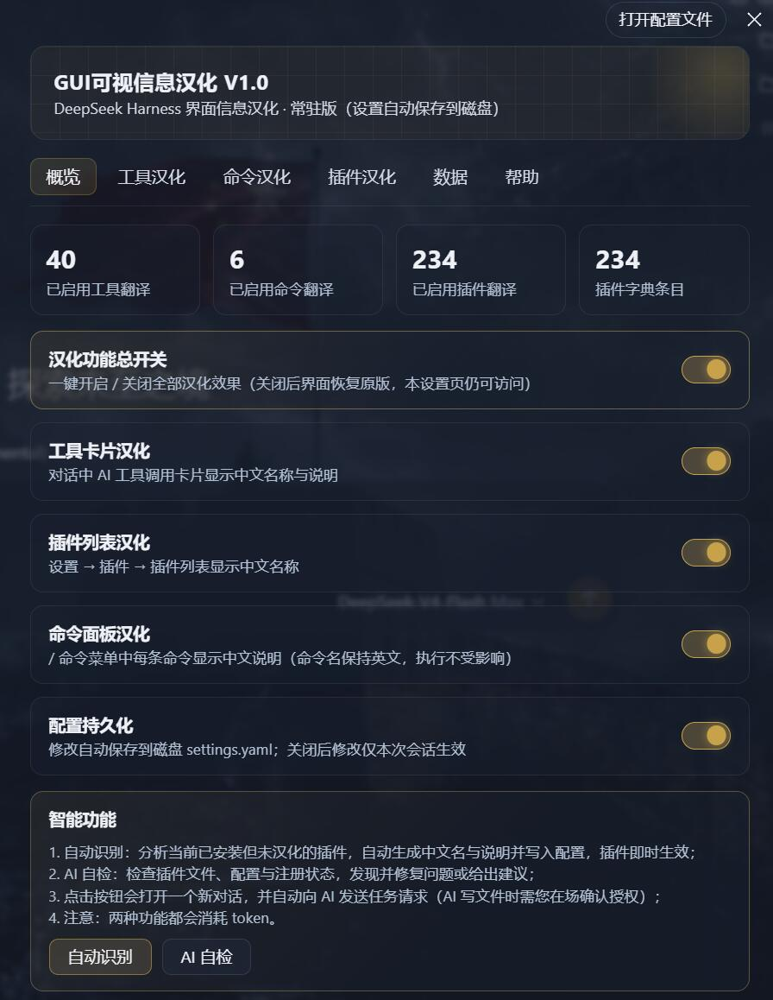
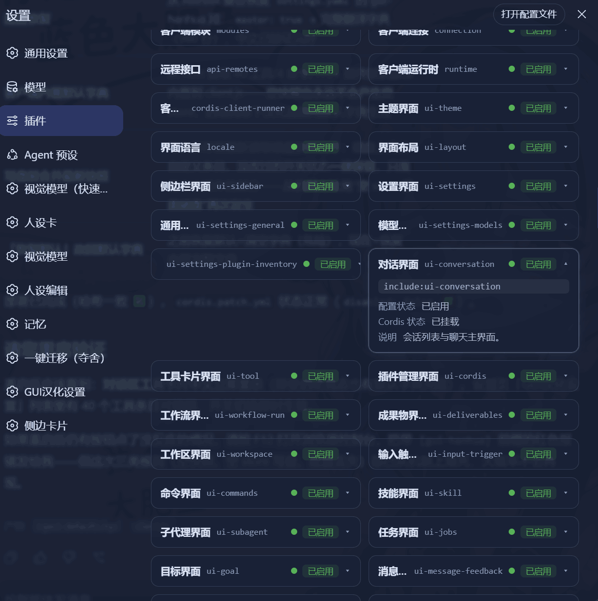
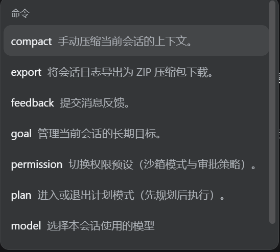
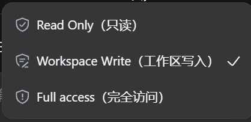

<div align="center">

# 🌏 dsh-gui-hanhua

### GUI Localization Plugin for DeepSeek Harness

> **Language should never be a barrier for Agents.**
>
> **语言永远不会成为 Agent 的门槛。**


A **resident** localization plugin that makes the DeepSeek Harness interface speak your language — tool cards, plugin lists, command menus, permission selectors, all in Chinese (with English originals preserved).

[🇨🇳 中文文档](./README.zh-CN.md)

</div>

---

## ✨ Features

| | Feature | Description |
|---|---|---|
| 🃏 | **Tool Card Localization** | AI tool-call cards in conversations show Chinese names + one-line descriptions (e.g. `pwsh` → 执行 PowerShell) |
| 📦 | **Plugin List Localization** | Settings → Plugins shows Chinese names for 230+ plugins, English originals kept |
| ⌨️ | **Command Menu Bilingual** | `/` menu shows **English command names + Chinese descriptions** — `/plan` → 计划模式：进入或退出计划模式（先规划后执行） |
| 🔐 | **Permission Selector Bilingual** | `Read Only（只读）` / `Workspace Write（工作区写入）` / `Full access（完全访问）` |
| 🎛️ | **Master Switch & Per-feature Switches** | One-click enable/disable everything, or each feature independently |
| 💾 | **Persistence** | All dictionaries auto-save to `settings.yaml`, restored after restart |
| 🤖 | **AI Auto-Localization** | One click opens a new conversation and lets the Agent analyze & translate any un-localized plugins automatically |
| 🩺 | **AI Self-Check** | One click lets the Agent inspect plugin files, configs and registration, then auto-fix issues |

---

## 📸 Screenshots

<div align="center">

**Main Settings Page** — master switch, feature switches & smart functions



<br/><br/>

**Plugin list fully localized** — 230+ plugins with Chinese names & descriptions



<br/><br/>

**Command menu bilingual** — English command name + Chinese description



<br/><br/>

**Permission selector bilingual** — `Read Only（只读）` / `Workspace Write（工作区写入）` / `Full access（完全访问）`



</div>

---

## 🚀 Installation

1. Copy this directory to your DSH profile:
   ```powershell
   # Example for the desktop profile:
   Copy-Item .\dsh-gui-hanhua -Recurse "$env:USERPROFILE\.dsh\profiles\web-desktop\node_modules\"
   ```
2. Register the plugin in `cordis.patch.yml` (both `web-desktop` and `web` profiles if you use both):
   ```yaml
   - insert:
       - id: gui-hanhua
         name: 'dsh-gui-hanhua'
         disabled: false
   ```
3. **Restart DeepSeek Harness** — the plugin loads automatically (resident plugin, no manual run needed).
4. Open **Settings → GUI汉化设置** to manage everything.

> 💡 No build step required: the client half is a hand-written bundle — refresh the page after client-side changes; restart after host-side changes.

---

## ⚙️ Configuration

All configuration lives in the `gui-hanhua` section of `settings.yaml`:

| Field | Description |
|---|---|
| `flags.master` | Master switch (all effects) |
| `flags.toolCards` | Tool card localization |
| `flags.pluginList` | Plugin list localization |
| `flags.commandMenu` | Command menu bilingual descriptions |
| `flags.persist` | Persist changes to disk |
| `tools` / `plugins` / `commands` | Translation dictionaries (`zh` / `desc` / `enabled` per entry) |

You can edit everything from the GUI settings page — search, add, remove, enable/disable entries.

---

## 🧠 Smart Features (AI-powered)

The settings page includes two AI-powered buttons that open a **new conversation** and auto-send a task prompt to the Agent:

| Button | What the Agent does |
|---|---|
| **自动识别 (Auto-Localize)** | Scans currently installed but un-localized plugins/tools, designs Chinese names & descriptions, writes them into `settings.yaml` — the plugin picks them up immediately |
| **AI 自检 (Self-Check)** | Inspects registration status, file integrity, config completeness and conflicts; fixes what it can and reports the rest |

> ⚠️ Both features consume **tokens**, and file writes require your in-session approval.

---

## 🔧 How It Works

- **Client half** (`client.js`): hand-written ModuleLoader bundle — registers settings page, tool-card/plugin-list/command-row slots, and the permission dictionary.
- **Host half** (`index.js`): registers the `gui-hanhua` settings namespace, persists dictionaries, and injects a read-only bilingual hook into `dsh-commands` (command descriptions) via `vendor/dsh-commands-hanhua.js`.
- **Safety-first design**: every patch is idempotent, fails silently (logs a warning), and behaves exactly like the original when the plugin is not loaded. The plugin never breaks the GUI even if it errors by itself.

---

## ❓ FAQ

- **Cards not localized?** Check the master switch and the corresponding feature switch, and make sure the entry exists in the dictionary and is enabled.
- **Settings entry missing?** Check `cordis.patch.yml` for `disabled: true` on the `gui-hanhua` row.
- **Command descriptions not showing?** Make sure the **命令面板汉化** switch is on and the command exists in the `commands` dictionary.
- **Garbled text?** Usually an encoding issue — run **AI 自检** and let the Agent inspect and fix the affected files.

---

## 🤝 Contributing

This project is designed for easy modification:

- All default dictionaries (`DEFAULT_TOOLS` / `DEFAULT_COMMANDS` / `DEFAULT_PLUGINS`) are defined in one place.
- AI task prompts (`buildAutoPrompt` / `buildSelfCheckPrompt`) are easy to customize.
- All UI copy lives inline in the client bundle — no external assets required.
- Deployment is just copy + register; no build step.

Feel free to open issues and pull requests!

---

## 📄 License

[MIT](./LICENSE) © 2026

<div align="center">

**语言不会是 Agent 的门槛** · Language should never be a barrier for Agents

</div>
